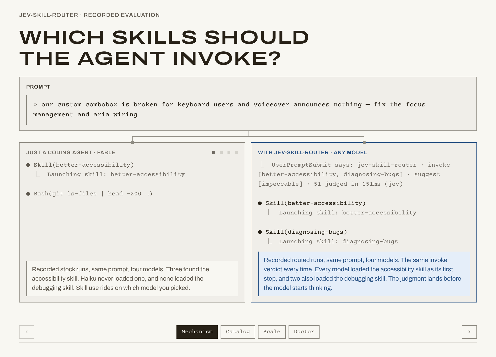

# jev-skill-router

**Per-turn skill routing for Claude Code.** A [Jev](https://typesafe.ai)-powered router that
scores every skill against every prompt, turning the model's hidden "should I use this
skill?" judgment call into probabilities that code can act on.

[Demo](https://abgregs.github.io/jev-skill-router/) · [Install](#install) ·
[What it guarantees](#what-it-guarantees) · [What the experiment found](#what-the-experiment-found) ·
[Who it's for](#who-its-for) · [How it works](#how-it-works) · [Everyday use](#everyday-use) ·
[Configuration](#configuration) · [Results](#results) · [Docs](docs/README.md)

[](https://abgregs.github.io/jev-skill-router/)

**[Open the recorded demo →](https://abgregs.github.io/jev-skill-router/)** Real Jev runs
over a real 51-skill catalog, replayed in the browser. No key needed.

## Install

> [!NOTE]
> **Requires** Claude Code, Node 20.12+ on your `PATH`, and a TypeSafe API key.

To install, run:

```
claude /plugin marketplace add abgregs/jev-skill-router
claude /plugin install jev-skill-router@abgregs
```

In the Claude Code desktop app or an already open Claude Code session, run:

```
/plugin marketplace add abgregs/jev-skill-router
/plugin install jev-skill-router@abgregs
```

Enter your TypeSafe key when Claude Code asks; it's kept in your system's credential store.
From then on, every prompt is routed before the model sees it.

> [!TIP]
> **Cost:** one Noul per routed skill per prompt (51 skills = 51 Nouls). Excluded skills are
> never judged and cost nothing. The router is not a cost or latency saver: in a paired
> multi-turn A/B on opus it loaded more skill text and spent more time and money than
> stock selection. What it buys is coverage and control (see [Results](#results)).

CLI install, the key lookup order, uninstalling, and local development:
[install guide](docs/guide/install.md).

## What it is

A working Claude Code plugin, and an experiment in using a judgment model as the control
plane for skill selection. The plugin routes every prompt. The experiment asks what changes
when that decision is made by scored judgments instead of by the model in the session. The
findings are as much the point as the tool.

## What it guarantees

- **The decision doesn't depend on the session model.** The same prompt and catalog produced
  the same invoke list on fable, sonnet, opus, and haiku. In our runs, identical requests
  returned scores that differed by about 0.01, so a skill sitting on a cut can flicker: the
  decision is reproducible to that floor, not deterministic. What the model then does with
  the verdict still varies by model.
- **Every decision is visible.** Every skill is scored on every turn. In a session you see one
  line per routed turn: what was invoked, what was suggested, how many skills were judged,
  and how long it took. The scores themselves come from the CLI: `jev-skill-router route`
  prints every skill's probability for any prompt, so a skill that should have fired can be
  shown its number. Set `log` in `.skillrouter.json` and every turn's scores are written to
  a session log as well ([recording scores](docs/guide/claude-code-hooks.md#recording-scores)).
- **Every description is read, at any catalog size.** Claude Code drops skill descriptions
  from its listing once they exceed a fraction of the context window. The router judges all
  of them in parallel: 51 skills in 121–270ms, 1,064 in about half a second. Spend is one
  Noul per skill per prompt, so it grows with the catalog.
- **Control is per prompt, in code.** Thresholds, an invoke band and a suggest band,
  `exclude`, `alwaysAllow`, and a gate that holds the model to the verdict, in place of
  per-skill switches set once.

## What the experiment found

Recorded runs grade the judge alone; development runs put a session model in the loop
([the tiers](docs/findings/README.md)).

- **Frontier models skip workflow skills.** In a paired multi-turn A/B on opus, the router's
  only hit advantage, 18/18 to 14/18, was `git-commit` and `git-create-pr`; opus did the
  commit with raw git in two of three sessions. Task skills it found on its own.
  Development run.
- **Descriptions are the routing surface, and hierarchies fall out of them.** The same
  orchestrator scored 0.09 on a narrow build and 0.97 on a holistic review
  ([finding 0001](docs/findings/0001_hierarchies-read-from-descriptions.md)). Recorded runs.
- **Invoke and suggest are different speech acts.** Models load a commanded list and consult
  a suggested one ([finding 0003](docs/findings/0003_invoke-is-a-command-suggest-is-a-menu.md)).
  Development.
- **Single-turn evals miss the failure that matters.** Topic switches mid-session broke the
  judge until its input was reframed, and only a multi-turn bench caught it
  ([finding 0004](docs/findings/0004_weight-current-request-over-transcript.md)). Development.
- **It is not a cost or latency saver.** About 0.3s and one Noul per skill per turn, and the
  model loads and does more with the skills it is handed
  ([bench results](bench/results/README.md#multi-turn-cost-ab--2026-10-08-released-bundles-opus-symmetric-stop-rule)).
  Development.
- **Judgment-model lessons.** Nouls over a Choice for multi-select and lossless sharding, the
  noise floor, context rot from unrelated state, and a two-sided question for "go" turns
  ([how routing works](docs/architecture/how-routing-works.md)).

## Who it's for

- **Skill authors:** see how a skill scores against real prompts and where it collides with
  its siblings ([route](docs/guide/cli.md), [doctor](docs/guide/catalog-doctor.md)).
- **Large-catalog maintainers:** proof the model sees every skill, and any skill's score for
  any prompt on demand, with no context fraction to tune.
- **Teams with process mandates:** workflow skills that standing instructions require fire
  instead of being skipped.
- **People building or evaluating tool selection:** the methodology findings above.
- **Developers curious about Jev:** a worked control-plane pattern in a real harness.

**Trade-offs.** It adds cost and latency rather than removing them. Overlapping catalogs
co-invoke, which the doctor exists to clean up. The gate fails open and is not a security
boundary. It runs only in Claude Code. And a frontier model on a small catalog already finds
its task skills without help.

## How it works

Before the model sees your prompt, Jev scores every skill against it. Plain-code thresholds
turn those scores into a verdict that is added to the model's context, and a gate holds the
model to it.

- **What Jev reads:** your prompt, with up to ~8,000 characters of conversation as
  background, against each skill's name and description. Not `CLAUDE.md`, open files, or
  tool output. A bare "go" is judged against the plan it approves.
- **Two bands:** skills at 0.85 or above are invoked (up to 6); skills from 0.80 to 0.85 are
  suggested by name for the model to use if a need shows up.
- **The gate:** holds the model to the turn's list, with two ways through for a skill that
  isn't on it: a skill the model already loaded names it in its SKILL.md, or Jev judges the
  call useful for the work when the model makes it. It fails open: a relevance filter, not
  a lock.
- **Fast at any size:** every skill is judged in parallel. Recorded runs: 51 skills in
  121–270ms, 1,064 in about half a second.

Details: [how routing works](docs/architecture/how-routing-works.md) ·
[Claude Code hooks](docs/guide/claude-code-hooks.md).

## Everyday use

| I want to… | Do this |
|---|---|
| Make sure a skill runs this turn | Slash-invoke it: `/git-commit`. |
| Keep a skill callable every turn (e.g. one your `CLAUDE.md` requires) | Add it to `alwaysAllow`. |
| Never route a skill | Add it to `exclude`. It's never judged and costs nothing. |
| Get fewer or more skills per prompt | Raise or lower `threshold` (0.85), or change `maxSelected` (6). |
| Find duplicate or overlapping skills | Run the [catalog doctor](docs/guide/catalog-doctor.md). |
| See what the router would pick | `jev-skill-router route "<prompt>"` ([CLI](docs/guide/cli.md)). |

> [!IMPORTANT]
> Asking for a skill in words ("use the git-commit skill") doesn't guarantee it runs. It can
> raise the skill's score, but only a slash command or `alwaysAllow` gets it past the gate
> without a judgment.

## Configuration

Routing works with no config file. To tune it, write `.skillrouter.json` in the folder you
start Claude Code from, or `~/.skillrouter.json` for every project.

```json
{
  "threshold": 0.85,
  "exclude": ["debrief"],
  "alwaysAllow": ["git-commit", "anthropic-skills:pdf"]
}
```

| Key | Default | Purpose |
|---|---|---|
| `threshold` | `0.85` | Invoke bar. Set `0.9` for precision. |
| `suggestFloor` | `0.8` | Bottom of the suggest band. |
| `maxSelected` | `6` | Most skills invoked per prompt. |
| `exclude` | `[]` | Skills removed from routing. |
| `alwaysAllow` | `[]` | Skills the gate always lets through. |

> [!WARNING]
> The first file found wins and files don't merge: a project `.skillrouter.json` replaces
> your home file, lists included.

All keys, file precedence, and the `config` command: [configuration](docs/guide/configuration.md).

## Results

> [!IMPORTANT]
> These are the only routing-quality numbers the repo claims: 44 recorded runs on the
> released router, captured 2026-10-01 on a real 51-skill catalog, judged on the same inputs
> the plugin sends.

| Check | Result |
|---|---|
| Needed skills invoked (11 tasks) | **13 / 13** |
| User-only skill left alone | **1 / 1** |
| Off-catalog asks with no stand-in invoked | **5 / 5** |
| Prompts needing no skill with nothing invoked | **27 / 27** |

- The top-scoring skill landed at 0.97–0.99 on every task; on the off-catalog asks, the best
  wrong candidate topped out between 0.29 and 0.61.
- Small, single-turn, and labeled by us: evidence, not a benchmark.
- Not a cost or latency saver. A paired multi-turn A/B on the released bundles (opus, three
  six-turn sessions per arm, every turn run to completion) found the router hit 18/18
  expected skills to stock's 14/18, with the gap entirely the workflow skills the model
  skips on its own, and neither arm loading a skill needlessly. It also loaded 12k–40k
  more bytes of SKILL.md per session and cost $0.05–$0.45 and 11–72s more. Development
  tier, not a claim: [bench results](bench/results/README.md#multi-turn-cost-ab--2026-10-08-released-bundles-opus-symmetric-stop-rule).

Full breakdown and caveats: [results](docs/evaluation/results.md).

## Documentation

| Section | Pages |
|---|---|
| **Guide** | [Install](docs/guide/install.md) · [Configuration](docs/guide/configuration.md) · [Claude Code hooks](docs/guide/claude-code-hooks.md) · [CLI](docs/guide/cli.md) · [Catalog doctor](docs/guide/catalog-doctor.md) |
| **Architecture** | [How routing works](docs/architecture/how-routing-works.md) · [Repo layout](docs/architecture/repo-layout.md) |
| **Evaluation** | [Results](docs/evaluation/results.md) · [Running evals](docs/evaluation/running-evals.md) |
| **Findings** | [All findings](docs/findings/README.md) |

### Findings

| # | Finding | Evidence |
|---|---|---|
| [0001](docs/findings/0001_hierarchies-read-from-descriptions.md) | Skill hierarchies are read from descriptions alone; skills sharing the ask co-invoke. | Recorded runs |
| [0002](docs/findings/0002_co-invocation-improved-output.md) | Co-invoking overlapping skills improved output. | Development |
| [0003](docs/findings/0003_invoke-is-a-command-suggest-is-a-menu.md) | Models follow invoke wholesale, to a degree that varies by model, and consult suggest when needed. | Development |
| [0004](docs/findings/0004_weight-current-request-over-transcript.md) | Weight the current request over the transcript; bench multi-turn. | Development |

## Development

<details>
<summary>Run it from a clone</summary>

```bash
git clone https://github.com/abgregs/jev-skill-router
cd jev-skill-router
npm install && npm link    # puts jev-skill-router on your PATH

npm run inspect     # pure-code smoke test (mock judge, no key)
npm run typecheck
npm run demo        # recorded web demo, no key
```

More scripts: [CLI](docs/guide/cli.md#npm-scripts-from-a-clone) ·
[running evals](docs/evaluation/running-evals.md) ·
[repo layout](docs/architecture/repo-layout.md).

</details>

## License

[MIT](LICENSE)
